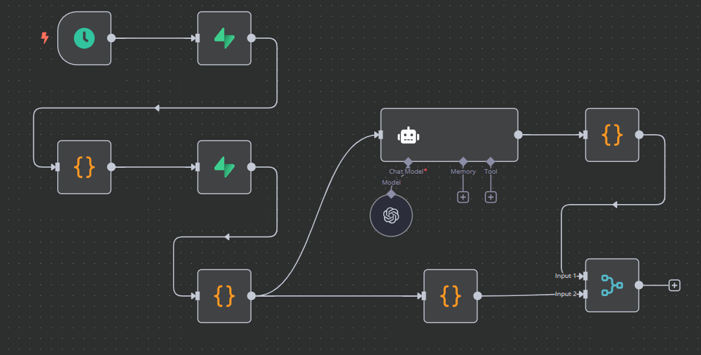

# Este repositório irá abrigar meus projetos, sempre que eu julgue que sejam sólidos e interessantes o suficiente.
 

## Projeto: Automação inteligente para detecção de inconsistências em banco de dados.
## Diagrama do workflow n8n para detecção de registros inconsistentes.

  

  ## Tecnologias Utilizadas
    
    
    
  

## Próximos Passos
* Implementar validações adicionais.
* Integrar com outros sistemas de notificação.

