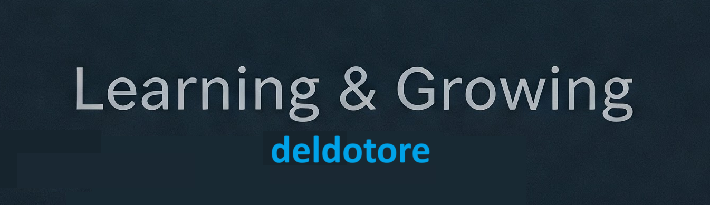

<p align="center">
  
</p>

## 👨‍💻 Quem sou eu

Sou um desenvolvedor em aprendizado, entusiasmado com tecnologia e inovação. Adoro resolver problemas complexos e transformar ideias em soluções reais. Estou sempre em busca de desafios que me permitam aprender e crescer profissionalmente.

Este repositório irá abrigar meus projetos, sempre que eu julgue que sejam sólidos e interessantes o suficiente.

## 🚀 Habilidades

```python
minhas_habilidades = {
    "linguagens": ["Python"],
    "ferramentas": ["Git", "VS Code"],
    "plataformas": ["Supabase"],
    "automacao": ["n8n"],
    "containerizacao": ["Docker"],
    "areas": ["Machine Learning", "Análise de Dados", "Deep Learning", "Automação de Processos"]
}
````
## 🌱 Atualmente estou...

- 📚 Aprendendo sobre Inteligência Artificial, especialmente Machine Learning.
- 🛠️ Trabalhando em projetos pessoais para ampliar meu portfólio.

<!-- ## 📊 Estatísticas

<div align="center">
  
  
</div>

<!-- ## 🔍 Projetos em Destaque 

<div align="center">
  <a href="https://github.com/SEU_USERNAME/projeto1">
    
  </a>
  <a href="https://github.com/SEU_USERNAME/projeto2">
    
  </a>
</div> -->

## 📫 Como me encontrar

<div align="center">
  
  <a href="https://linkedin.com/in/reinaldo-del-dotore" target="_blank"></a>

  <a href="mailto:deldotore@gmail.com"></a>
  <!--<a href="https://twitter.com/seu-twitter" target="_blank"></a>
  <a href="https://seu-portfolio.com" target="_blank"></a> -->
</div>

<!-- ## ⚡ Curiosidades

- 🎮 Gosto de jogar [insira seus jogos favoritos]
- 📚 Livro favorito: [insira seu livro favorito]
- 🎯 Meta para este ano: Contribuir mais em projetos open source
- 🎵 Ouço [seu estilo musical] enquanto codifico

---
-->
<br>
<br>
<div align="center">
  
<br>
  <p>"O código é como humor. Quando você tem que explicar, é ruim." – Cory House</p>
</div>
